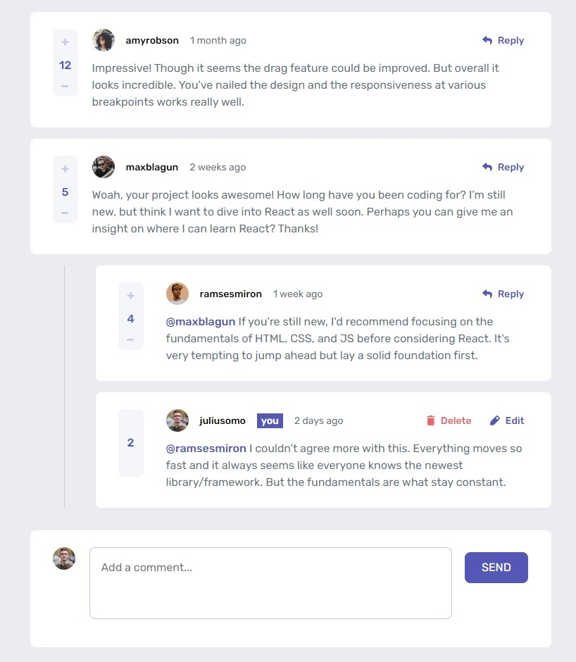

# Frontend Mentor - Interactive comments section solution

This is a solution to the [Interactive comments section challenge on Frontend Mentor](https://www.frontendmentor.io/challenges/interactive-comments-section-iG1RugEG9). Frontend Mentor challenges help you improve your coding skills by building realistic projects.

## Table of contents

- [Overview](#overview)
  - [Screenshot](#screenshot)
  - [Links](#links)
  - [Built with](#built-with)
- [Author](#author)

## Overview

Users should be able to:

- View the optimal layout for the app depending on their device's screen size
- See hover states for all interactive elements on the page
- Create, Read, Update, and Delete comments and replies
- Upvote and downvote comments
- View comments across page reloads

### Screenshot

### Links

- Solution URL: [Frontend Mentor](https://www.frontendmentor.io/solutions/interactive-comments-section-using-vanilla-js-and-scss-wK8KREGdSd)
- Live Site URL: [GitHub Page](https://nastaj.github.io/interactive-comments-section/)

### Built with

- Semantic HTML5 markup
- SASS/SCSS
- Flexbox
- CSS Grid
- Vanilla JavaScript
- LocalStorage

## Author

- Frontend Mentor - [@nastaj](https://www.frontendmentor.io/profile/nastaj)
- Discord - [@aseirel]
